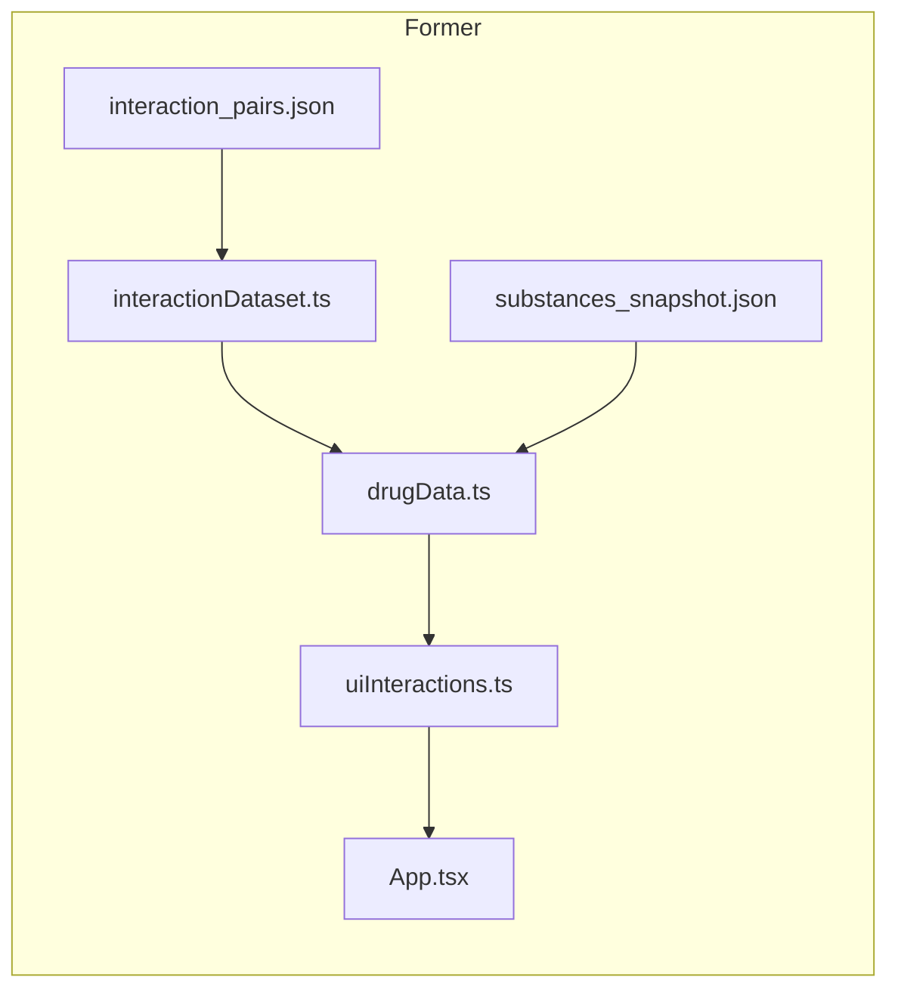
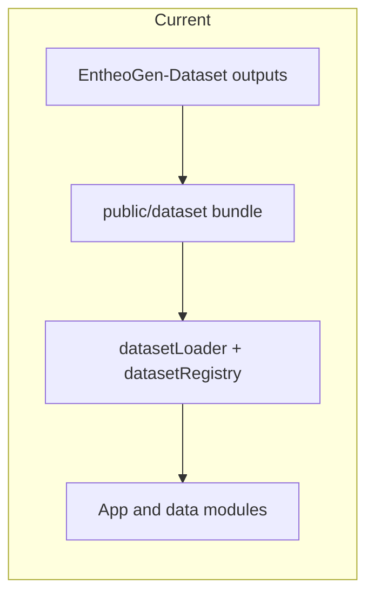

# Separate EntheoGen web UI from the dataset

Saved copy of the implementation plan (Cursor plan `separate_ui_from_dataset`). Source: EntheoGen workspace planning session.

## Current status

This plan has been mostly implemented for the rollback branch. The browser app
now starts with an explicit async dataset boundary:

- `src/main.tsx` calls `loadAppDatasetBundle()` before rendering `App`.
- `src/data/datasetLoader.ts` fetches `manifest.json`,
  `interaction_pairs.json`, and `substances_snapshot.json` from
  `/dataset/` or `VITE_DATASET_BASE_URL`.
- `src/data/datasetRegistry.ts` owns the in-memory registered dataset.
- `drugData.ts`, `uiInteractions.ts`, and `sourceLinking.ts` read through the
  registry instead of importing the public JSON at module load.
- `npm run build` runs `prebuild -> dataset:sync-public`, which copies source
  snapshots into `public/dataset/` for the static deploy.

The deployed app remains static-only. Supabase or Postgres can be used by local
scripts to refresh source snapshots, but database credentials do not belong in
the browser bundle.

## Former coupling

Earlier versions coupled the UI directly to build-time JSON imports and
module-level maps. That has been replaced with a defined contract and injection
point for where data comes from: same-origin `public/dataset/` for static
deploys, or an equivalent remote static base via `VITE_DATASET_BASE_URL`.

## Alignment with EntheoGen-Dataset

**EntheoGen-Dataset `AGENTS.md`** already forbids writing into the EntheoGen app from dataset scripts and prefers **inspectable artifacts under `outputs/`**. Add (or document) a single **“app bundle”** export in the dataset repo — e.g. `outputs/app-bundle/` containing:

- `interaction_pairs.json` (same shape the UI expects today, or a versioned wrapper)
- `substances_snapshot.json`
- `manifest.json` with **semver or content hash** and optional column/schema version

That keeps **source of truth** in the dataset repo while the UI repo stays **rendering + heuristics** (e.g. `PRIORITY_INTERACTION_RULES`, narrative copy in `drugData`).

## Contract: types and validation

- **Types**: Keep TypeScript interfaces in the UI (or extract a tiny shared package later). Minimum: document that `InteractionPair` / `Drug` match the emitted JSON; optionally validate at load with JSON Schema under EntheoGen-Dataset `schemas/` if you add a schema that matches the app bundle.
- **Versioning**: Loader reads `manifest.json`, accepts schema version `1`,
  warns only for explicitly registered compatible versions, and throws for
  unsupported versions.

## Delivery modes (pick one primary; others optional)

| Mode | Pros | Cons |
|------|------|------|
| **A. Build-time inject (CI / local script)** | No CORS, no loading flash, static hosting friendly | Redeploy app to change data |
| **B. Runtime `fetch` from URL** | Update dataset without rebuilding SPA | Needs hosting + CORS; async refactor |
| **C. Versioned npm package** | Reproducible installs | Publish overhead; still a bundle step |

**Current primary mode:** Mode A. The repo stores source snapshots, syncs them
into `public/dataset/`, and deploys static Vite output. Mode B is available by
serving the same bundle layout from a remote static base.

## App refactor (minimal but structural)

1. `main.tsx` bootstraps the dataset before rendering `App`.
2. `datasetRegistry.ts` holds `{ drugs, interactionPairs, maps, rules }`.
3. `drugData.ts` and `uiInteractions.ts` consume the registry.
4. `datasetLoader.ts` supports same-origin `/dataset/` and remote
   `VITE_DATASET_BASE_URL`.

## Dataset repo work

- One script or Make target: **“export app bundle”** from the canonical normalized + approved path used for publication (same “display artifact” boundary pattern as Hugging Face reviewed export docs).
- Optional: same bundle uploaded to **R2 / Pages asset** or Hugging Face **dataset file** for Mode B — HF is **distribution**, not authority.

## Verification

- `npm run typecheck` and `npm run build` with **injected** bundle in CI.
- Smoke: substance count, a few known `pair_key` lookups, and that **priority overrides** in `src/data/priorityInteractionOverrides.ts` still win over dataset rows where intended.

## Supabase

Supabase Phase 1 is an authoring/export source, not a browser runtime source.
Use local environment credentials to export or align data into the source
snapshots, then sync `public/dataset/` and deploy static assets. Do not add a
Supabase client or Postgres connection string to the browser bundle.

## Implementation todos (checklist)

- [x] Define app-bundle layout (`interaction_pairs.json`, `substances_snapshot.json`, `manifest.json`).
- [x] Add `datasetLoader` + registry in EntheoGen; refactor `drugData` / `uiInteractions` to consume registered data.
- [x] Wire build-time `public/dataset/` copy and optional `VITE_DATASET_BASE_URL` fetch.
- [ ] Stop tracking large JSON in UI repo (`.gitignore`) and document handoff path from EntheoGen-Dataset.
- [ ] Run typecheck, build, and smoke-test pair lookups and override precedence.
